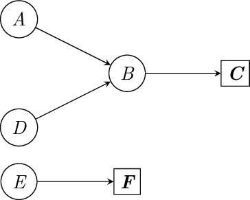
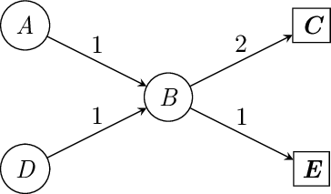

# Coreference-based Graph Search (CGS)

## Foundational CGS

To elucidate the process of CGS, we illustrate it with a straightforward case.

### Example

Consider the set of nodes:

- $A, B, C, D, E, F$

The coreference relationships are:

- $A \to B$
- $B \to \mathbf{C}$
- $D \to B$
- $E \to \mathbf{F}$

Here, $\mathbf{C}$ and $\mathbf{F}$ are manually designated as **Primary Terms**.



### CPTG requirements

The “Coreference Primary Term Graph (CPTG)” can be constructed from the above nodes and directed edges. This CPTG must satisfy:

1. It is a **Directed Acyclic Graph (DAG)**.
2. The **out-degree of any Primary Term** is **zero**.
3. The **out-degree of any node** is **≤ 1**, indicating **no branching nodes**.

### Precomputed dictionary

Once a CPTG is constructed, preliminary graph computations can be conducted to optimize queries, in order to identify the **ultimate Primary Term** corresponding to any term node.

The results of these computations are stored in a newly created dictionary $D$. Notably, $D$ also includes **self-referencing mappings** for Primary Terms (e.g., $\mathbf{C}\to\mathbf{C}$), enabling the queried term itself to be recognized as a Primary Term.

Example of the resulting dictionary mappings:

- $A \to \mathbf{C}$
- $B \to \mathbf{C}$
- $D \to \mathbf{C}$
- $E \to \mathbf{F}$
- $\mathbf{C} \to \mathbf{C}$
- $\mathbf{F} \to \mathbf{F}$

Thus, by searching this dictionary, we can quickly determine whether a corresponding Primary Term exists for any given term (including Primary Terms themselves). If found, the associated value is its Primary Term.

### Algorithm 1: Foundational CGS

```text
Algorithm 1: Foundational CGS
Input:  Set of nodes N, coreference relationships R
Output: Dictionary D storing the ultimate Primary Terms

1.  Initialize dictionary D
2.  Construct the Coreference Primary Term Graph (CPTG) G from N and R
3.  for each node n in G do
4.      if n is not a Primary Term then
5.          Find the ultimate Primary Term p for n
6.          if p exists then
7.              Add mapping n → p to D
8.          end if
9.      else
10.         Add self-referencing mapping n → n to D
11.     end if
12. end for

For searching:
13. Given any term t, query D to ascertain whether a corresponding Primary Term exists
14. if t exists in D then
15.     Retrieve the corresponding Primary Term p from D
16. end if
```

## Weighted CGS

During the construction of the CPTG, directed edges are typically extracted automatically from databases. Consequently, we often cannot satisfy the third requirement of CPTG (i.e., **no branching nodes**). In such cases, we assign a **weight** to each directed edge and conduct a **weighted graph search**.

### Example

Consider the set of nodes:

- $A, B, C, D, E$

The coreference relationships are given as follows (each edge has a weight):

- $A \xrightarrow{w_{AB}=1} B$
- $B \xrightarrow{w_{BC}=2} \mathbf{C}$
- $D \xrightarrow{w_{DB}=1} B$
- $B \xrightarrow{w_{BE}=1} \mathbf{E}$

Here, $\mathbf{C}$ and $\mathbf{E}$ are manually designated as **Primary Terms**.

This CPTG satisfies the first two requirements (DAG; Primary Terms have out-degree 0), but violates the third requirement because $\mathbf{B}$ branches to both $\mathbf{C}$ and $\mathbf{E}$.



### Weighted graph search rule

When computing the ultimate Primary Term for a node:

1. Retrieve all downstream directed edges from the current node.
2. **Select the outgoing edge with the highest weight** to determine the next node.
3. Repeat until reaching a **Primary Term**.

**Example path for node $A$:**

- From $A$, the only downstream node is $B$.
- From $B$, there are two options: $B \to \mathbf{C}$ (weight $2$) and $B \to \mathbf{E}$ (weight $1$).
- Since $2 > 1$, choose $B \to \mathbf{C}$.
- Stop at $\mathbf{C}$ because it is a Primary Term.

Therefore, the ultimate Primary Term for $A$ is $\mathbf{C}$, with the path:

- $A \to B \to \mathbf{C}$
  rather than:
- $A \to B \to \mathbf{E}$.

### Resulting dictionary

Using this rule, we can still construct a dictionary consistent with Foundational CGS:

- $A \to \mathbf{C}$
- $B \to \mathbf{C}$
- $D \to \mathbf{C}$
- $\mathbf{C} \to \mathbf{C}$
- $\mathbf{E} \to \mathbf{E}$

### Algorithm 2: Weighted CGS

```text
Algorithm 2: Weighted CGS Algorithm
Input:  Set of nodes N, coreference relationships R, weights W of directed edges
Output: Dictionary D storing the ultimate Primary Terms

1.  Initialize dictionary D
2.  Construct the Coreference Primary Term Graph (CPTG) G from N, R, and W
3.  for each node n in G do
4.      if n is not a Primary Term then
5.          Find the ultimate Primary Term p for n using weighted graph search
6.          if p exists then
7.              Add mapping n → p to D
8.          end if
9.      else
10.         Add self-referencing mapping n → n to D
11.     end if
12. end for

For searching:
13. Given any term t, query D to ascertain whether a corresponding Primary Term exists
14. if t exists in D then
15.     Retrieve the corresponding Primary Term p from D
16. end if
```

## Primary Term Extractor

Once we have a dictionary $D$ that maps terms to their Primary Terms, efficiently identifying all potential terms from $D$ within any given string $S$ becomes a significant challenge—especially when $D$ contains many similar or overlapping terms.

### Motivation (overlapping terms)

For example, consider the terms:

- “Ma-huang” (NMM ID: `NMM-0006`)
- “Ma-huang-duan” (NMM ID: `NMM-000A`)

Both are Generic Names of NMMs recorded in ShennongKB and included in our Primary Term Dictionary.

Suppose a user provides:

- **String 1:** `What is the NMM ID of Ma-huang?`
- **String 2:** `What is the NMM ID of Ma-huang-duan?`

A naïve string matching approach may match both “Ma-huang” and “Ma-huang-duan” in **String 2**, causing overlap and ambiguity in downstream extraction.

### Trie + longest-match strategy

To address this, we introduced a **Primary Term Extractor** within the CGS framework. It uses:

- a **Trie** data structure
- a **longest-match** strategy

This enables efficient and accurate extraction of all potential terms in $D$ that appear in any given string $S$, while avoiding overlaps.

### Algorithm 3: Primary Term Extractor

```text
Algorithm 3: Primary Term Extractor
Input:  Dictionary D mapping terms to their primary terms; text string S
Output: Mapping M from terms found in S to their primary terms

1.  Build a Trie T from the keys of D
2.  Initialize an empty mapping M
3.  Let n ← length of S
4.  Let index i ← 0
5.  while i < n do
6.      Candidates ← all prefixes of S[i:] that are in Trie T
7.      if Candidates is not empty then
8.          longest_match ← the longest string in Candidates
9.          primary_term ← D[longest_match]
10.         Add mapping longest_match → primary_term to M
11.         i ← i + length(longest_match)
12.     else
13.         i ← i + 1
14.     end if
15. end while
```
